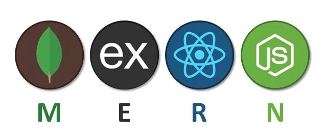
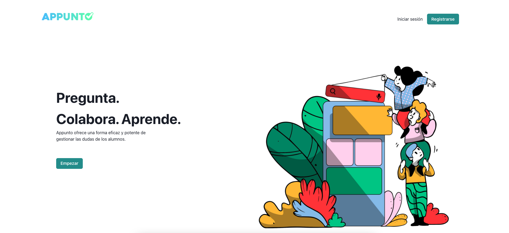
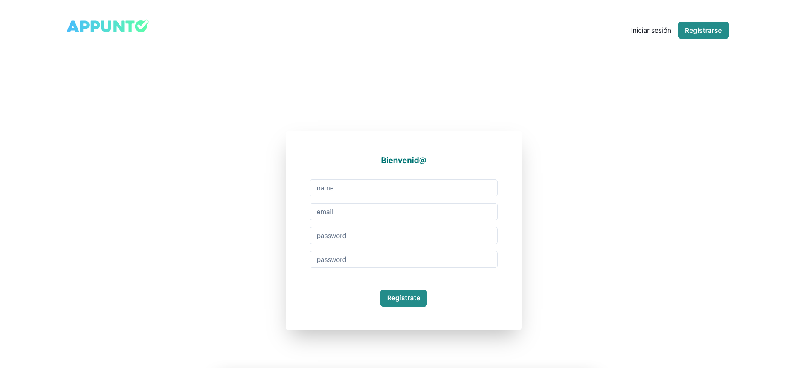
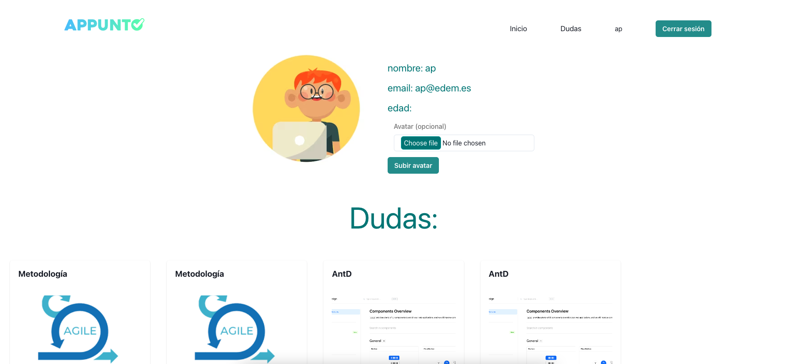

# React + Vite

# Proyecto de Frontend: App de Bonificación para Alumnos

- [@vitejs/plugin-react](https://github.com/vitejs/vite-plugin-react/blob/main/packages/plugin-react/README.md) uses [Babel](https://babeljs.io/) for Fast Refresh
- [@vitejs/plugin-react-swc](https://github.com/vitejs/vite-plugin-react-swc) uses [SWC](https://swc.rs/) for Fast Refresh

 <h3 align="center">React + Vite & Sass + Chakra</h3>

Ejercicio realizado durante la doceava y treceava semana del bootcamp para poner en práctica toda la teoría explicada durante las 2 mismas semanas del desarrollo del código con las tecnologías React + Vite y estilando con Sass + Chakra + CSS, como parte del frontend. La parte del backend está desarrollada en otro ejercicio previo llamado <i><a href="https://github.com/pafz/Appunto-MERN">Appunto-MERN</a></i>, se trata de una API REST educativa, con un backend desarrollado en JavaScript, utilizando Express, Mongosh y Mongoose para una integración sólida con una base de datos MongoDB. Bcrypt y JSON Web Token para garantizar la seguridad de los datos de los usuarios. Además, utiliza Nodemailer para confirmar correos electrónicos y mejorar la seguridad.

El concepto del proyecto es el de desarrollar la parte FRONT de una herramienta de gestión de puntos para los alumnos de una clase. Los puntos serán otorgados por el profesorado en función del rendimiento del alumnado. La acumulación de puntos representa el desarrollo del alumno y permite llevar una gestión de los alumnos en función de su rendimiento académico. Con la obtención de puntos, los alumnos se van posicionando entre la clase para obtener una serie de ventajas.

En este proyecto se unifica todo lo aprendido hasta ahora utilizando <a href="https://redux-toolkit.js.org/tutorials/quick-start">React Redux</a> con la profesora Sofía Pinilla, desarrollándose el FRONT donde los usuarios se registrarán, logearán, desloguearán, CRUD dudas, CRUD respuetas y darán likes. Donde habrá una zona admin.

;

<!-- TABLE OF CONTENTS -->

  
Contenido

  <ol>
    <li>
      <a href="#about-the-project">About The Project</a>
      <ul>
        <li><a href="#section-components">Components</a></li>
         <li><a href="#section-implement-react-router">Implement React Router on your site</a></li>
         <li><a href="#redux">use Redux</a></li>
         <li><a href="#use-sass">Sass Style</a></li>
         <li><a href="#chakra">Chakra UI</a></li>
      </ul>   
    </li>
    <li><a href="#notes">Notes</a></li>
    <li><a href="#observations">Observations</a></li>
    <li><a href="#future-roadmap">Future map road</a></li>
    <li><a href="#preview">Preview</a></li>
    <li><a href="#links">Links</a></li>
    <li><a href="#license">License</a></li>
    <li><a href="#contact">Contact</a></li>
  </ol>

<!-- ABOUT THE OBJECTIVES -->

<view id="about-the-project">
<h1>1. <strong>Sobre el proyecto</strong></h1>

En este proyecto se repasa todo lo aprendido hasta ahora. Por parejas desarrollaremos una app de bonificación con un MVP como requisitos mínimos. <a href="https://docs.google.com/document/d/1rwjvYcwLDaqaJ4C8k1zMNGD1cd2AhDG4vz3xNxx0jk8/edit">Enunciado en Google docs </a>

  <ol>
  

<strong>✺ Requisitos mínimos:</strong>
 👤
    <li>Registro de usuarios</li>
    <li>Login de usuarios</li>
❓ 
    <li>Visualización de Doubts y creación de nuevas</li>
    <li>Edición y eliminación de Doubts del usuario logueado</li>
    <li>Marcar/ quitar una duda como resuelta</li>
    <li>Buscador de perfiles de usuario o de dudas</li>
    <li>Que en tu perfil puedas ver tus datos y tus dudas</li>
📥 
    <li>Que puedas responder las dudas</li>
    <li>Uso de <a href="https://sass-lang.com/documentation/style-rules/" target="_blank">Sass</a> para los estilos</li>
    <li>Uso de <a href="https://chakra-ui.com/" target="_blank">Chakra</a> para estilos predefinidos</li>
        

        <strong>✺ Opcionales:</strong>
    <li>Frontend disponible en producción</li>
    <li>CRUD de las respuestas</li>
    <li>CRUD de las respuestas</li>
    <li>El usuario solo puede editar las respuestas que crea</li>
    <li>El usuario puede subir fotos en las dudas o cambiar su foto de perfil</li>
    <li>El usuario puede dar likes a las respuestas de las dudas</li>
    <li>Implementación de guards</li>
    <li>Que sea responsive</li>
    <li>Resposive</li>

</ol>
</view>

<!-- SECTION COMPONENTS -->

<views id="section-components">
          <h2><strong>Componentes mínimos - <a href="https://redux-toolkit.js.org/tutorials/quick-start">React Redux</a></strong></h2>
          <ul>
            <li>Register</li>
            <li>Login</li>
            <li>Home</li>
            <li>Doubts
            <ul>Post</ul>
            <ul>AddPost</ul>
            </li>
            <li>DoubDetail
            <ul>AddAnswer</ul></li>
            <li>Profile - User data & Doubts</li>
            <li>Header</li>
            <li>Footer</li>
          </ul>
</views>

<!-- REACT ROUTER -->
<views id="section-implement-react-router">
          <h2><strong>Implementación de <a href="https://reactrouter.com/en/main/router-components/browser-router" target="_blank">React Router</a></strong></h2>
          <ul>
            <li>/home - de la App de los Products</li>
            <li>/login</li>
            <li>/register</li>
            <li>/profile</li>
          </ul>
</views>

<!-- REDUX -->
<views id="redux">
          <h2><strong>Uso de <a href="https://redux-toolkit.js.org/tutorials/quick-start" target="_blank">Redux</a></strong></h2>
          <ul>
            
Redux es una herramienta para la gestión de estado en apps Javascript.

            
sirve para disponer del estado de la aplicación de forma transversal desde todos los componentes que lo necesiten, sin importar la jerarquía que estos tengan entre ellos.

            
instalación redux toolkit:

          <code>$ npm install @reduxjs/toolkit react-redux</code>
          </ul>
          
</views>

<!-- SASS -->
<views id="use-sass">
          <h2><strong>Uso de <a href="https://sass-lang.com/documentation/style-rules/" target="_blank">Sass</a> style</strong></h2>
          <ul style="list-style-type: square">
          <li>Nesting selecctores</li>
          <li>Creación de variables para reutilizar <strong>$</strong></li>
          <li>Importar un bloque para reutilizar <strong>%</strong></li>
          <li>Incluir el contenido de un archivo en otro <strong>@import ""</strong></li>
          <li>Herencia, compartir un conjunto de propiedades de un selector a otro <strong>@extend %</strong></li> 
            <code>$npm i sass</code> 
            Extensión del archivo es <i>App.<u>scss</u></i> 
            </ul>
</views>

<!-- CHAKRA -->
<views id="chakra">
          <h2><strong>Uso de <a href="https://chakra-ui.com/" target="_blank">Chakra UI</a></strong></h2>
          <ul>
          
es una biblioteca de componentes simple, modular y accesible que le brinda los componentes básicos necesarios para crear aplicaciones con React.
 
        <code>$ npm i @chakra-ui/react @emotion/react @emotion/styled framer-motion</code> 
</views>

<!-- NOTES -->
<views id="notes">
          <h1>2. <strong>Notas</strong></h1>
          <ul>
            <li>Los componentes no podrán sobrepasar las 400 líneas de código.</li>
            <li>Las funciones no deberán sobrepasar las 75 líneas de código.</li>
            <li><strong>BACKEND: </strong>Para poder hacer peticiones a la API ya mencionada hay que instalar el módulo de <strong>CORS</strong>: 
En el repo del <i><a href="https://github.com/pafz/1st_backend_project/">1st_backend_project</a></i>: <code>$npm i cors</code> 
En el <i>index.js</i>:  
<code>const cors = require(“cors”);</code> 
<code>app.use(cors());</code> 
</li>
          </ul>

</views>

<!-- OBSERVATIONS -->
<views id="observations">
          <h1>3. <strong>Observaciones</strong></h1>
          <ul>
<li>Tras la descarga de proyecto, instalar modules: <code>$npm i</code></li>
<li>Correr el proyecto desde la terminal: <code>$npm run dev</code> //port assigned auto</li>
          </ul>

</views>

(<a href="README.md#top">volver al principio </a>)

<!-- FUTURE ROADMAP -->

<views id="#future-roadmap">
<h1>4. <strong>Futuro Roadmap</strong></h1>

- [ ] More validations.
- [ ] Delete User.
- [ ] Buscador más específico.

(<a href="README.md#top">volver al principio </a>)

</views>

<!-- PREVIEW -->

<views id="preview">
<h1>5. <strong>Vista previa</strong></h1>

Home, Register, Profile

</views>

<!-- LINKS -->

<views id="links">
          <h1>6. <strong>Links</strong></h1>

External links of interest

<a href="https://sass-lang.com/documentation/style-rules/" target="_blank">Sass</a>
<a href="https://ant.design/components/overview" target="_blank">antd</a>
<a href="https://es.piliapp.com/symbol/" target="_blank">symbols</a>

</views>

<!-- LICENSE -->

<views id="license">
<h1>7. <strong>Licencia</strong></h1>
Este proyecto ha sido realizado como trabajo de aprendizaje por Patricia González & Patricia Fernández.

(<a href="README.md#top">volver al principio </a>)

</views>

<!-- CONTACT -->

<views id="contact">
<h1>8. <strong>Contacta</strong></h1>

  

Patricia González

& Patricia Fernández

(<a href="README.md#top">volver al principio </a>)

</views>
